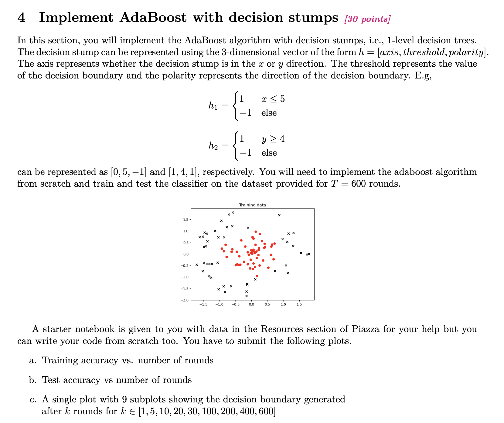
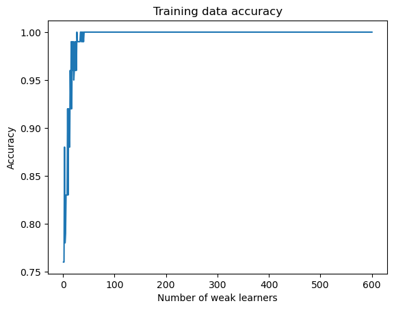
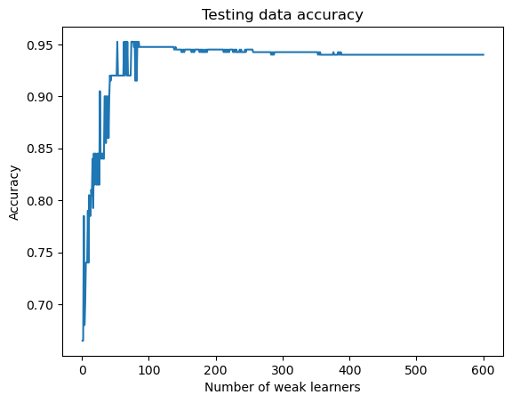
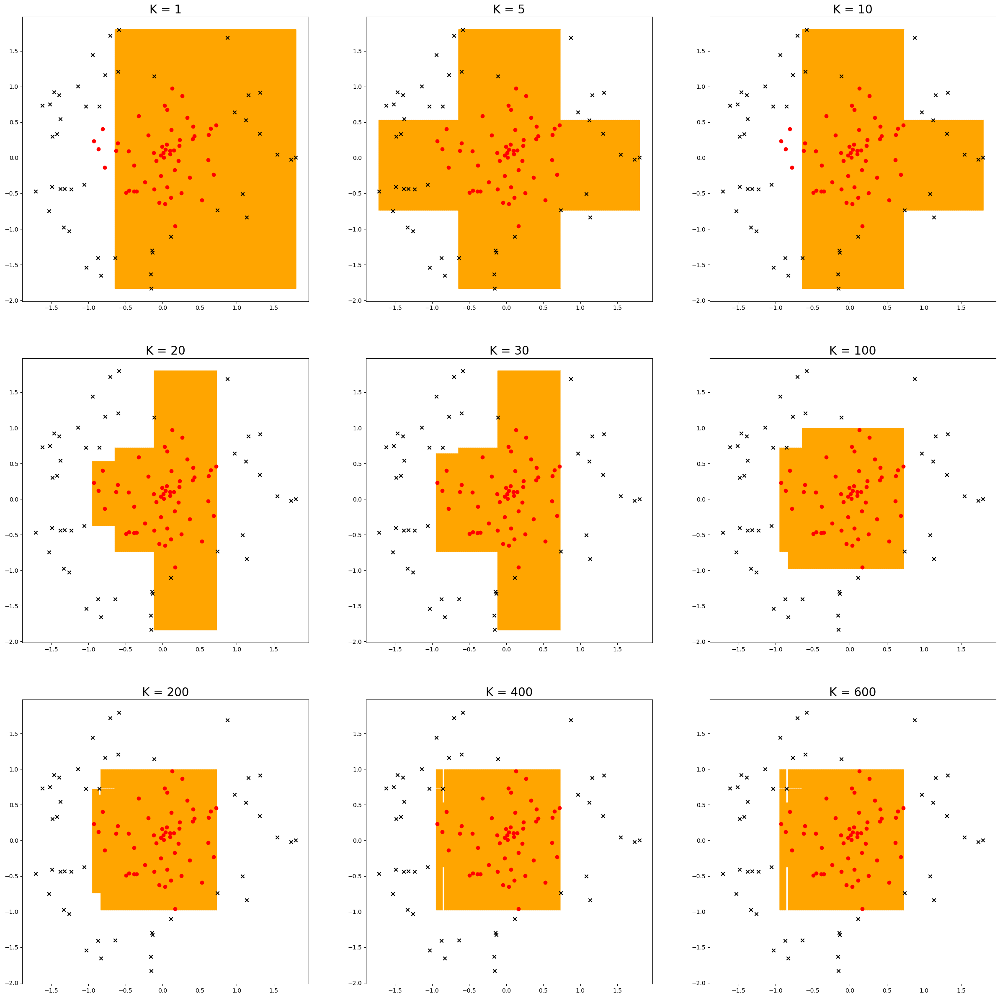

# AdaBoost-with-decision-stumps
AdaBoost with decision stumps

# Specs

# Train Data Accuracy

# Test Data Accuracy

# plot with 9 subplots showing the decision boundary generated after k rounds for k ∈ [1, 5, 10, 20, 30, 100, 200, 400, 600]

